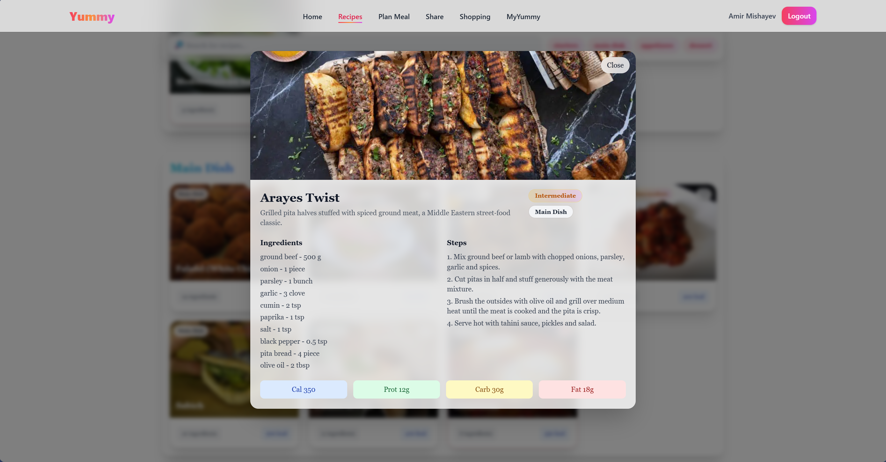
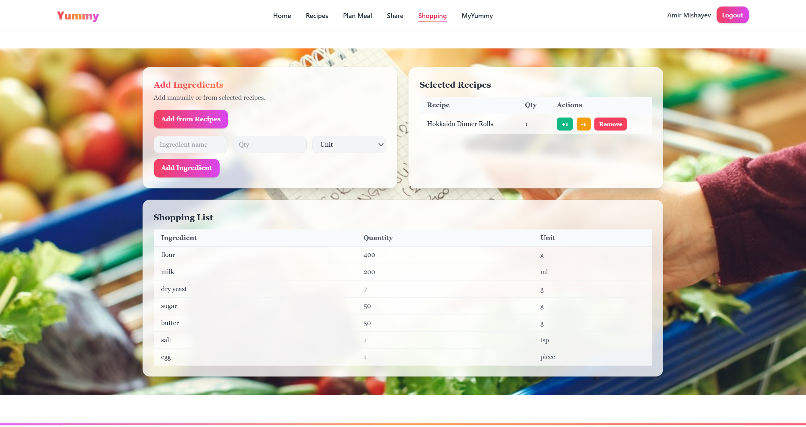

# Full-Stack Recipe Application

This project is a full-stack web application that allows users to search for recipes, manage meal plans, and create shopping lists based on selected recipes. It utilizes React for the frontend and Node.js with Express for the backend, integrating with MongoDB for data persistence. External APIs like Spoonacular for recipe data and ImageKit for image optimization are also used to enhance the functionality.

## Features

- Recipe searching and filtering
- Custom meal plan creation
- Shopping list generation from meal plans
- User authentication and profile management
- Real-time image optimization with ImageKit
- Nutritional information and ingredient details powered by Spoonacular


## Screenshots

Here are some visuals of key pages of the application:






## Demo

_A demo video showing the app in action will be added soon._

## Technology Stack

- **Frontend**: React, Axios
- **Backend**: Node.js, Express
- **Database**: MongoDB
- **External Services**: ImageKit, Spoonacular
- **Others**: CORS, dotenv

## Getting Started

These instructions will get you a copy of the project up and running on your local machine for development and testing purposes.

### Prerequisites

- npm
- Node.js
- MongoDB

### Installing

1. **Clone the repository**

```bash
git clone https://github.com/amir3x0/A6-Final.git
```

### Install Backend Dependencies

Navigate to the backend directory and install the necessary packages.

```bash
cd backend
npm install
```

### Install Frontend Dependencies

Open a second terminal, navigate to the frontend directory, and install the necessary packages.

```bash
cd frontend
npm install
```

### Running the Application

**NOTE:To simply open the website open the URL created in the github-pages**


**run the website via code-editor**
##Start the Backend Server

```bash
cd backend
npm start
```

##Start the Frontend Client

#Option 1, run on local host:
In /services/BackendService.js change the API_URL value to http://localhost:4000

and then use In a second terminal:
```bash
cd frontend
npm start
```

#Option 2, run on deployed server: 
In a second terminal:

```bash
cd frontend
npm start
```

The application should now be running and accessible in your browser.

## API Keys

You will need to obtain API keys for both ImageKit and Spoonacular and add them to your .env file in the backend directory.

## Additional Installations

If you encounter any missing package errors, you can install them using the following commands:

```bash
# Install Express
npm install express

# Install Mongoose for MongoDB interaction
npm install mongoose

# Install CORS for handling cross-origin requests
npm install cors

# Install Axios for making HTTP requests
npm install axios

# Install dotenv for managing environment variables
npm install dotenv
```

## Acknowledgments

- ImageKit.io for image management
- Spoonacular for recipe data
